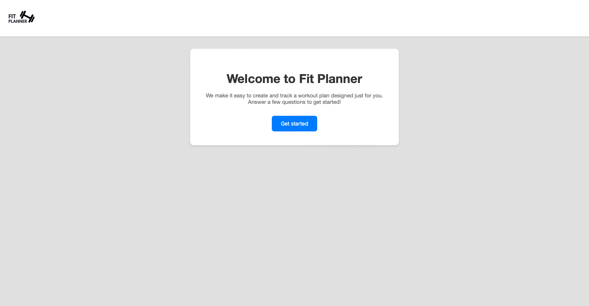
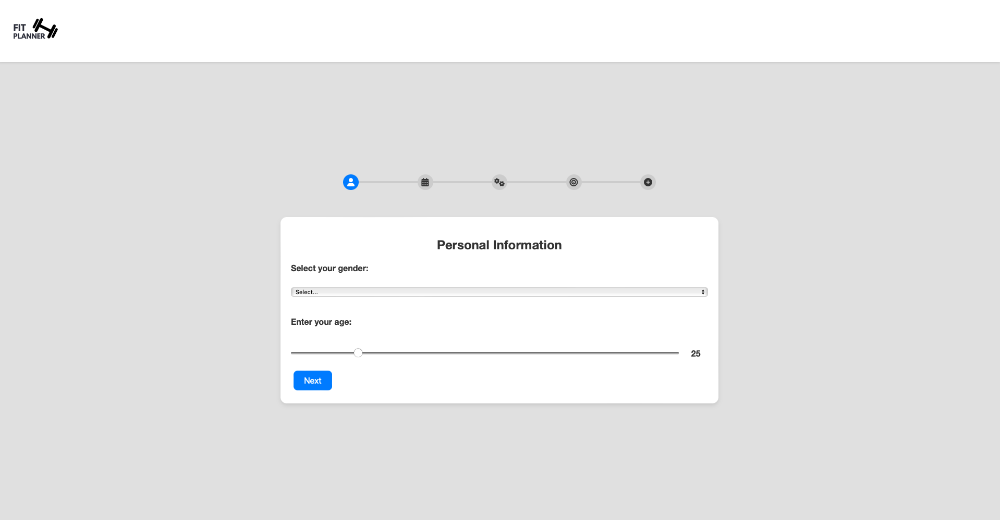
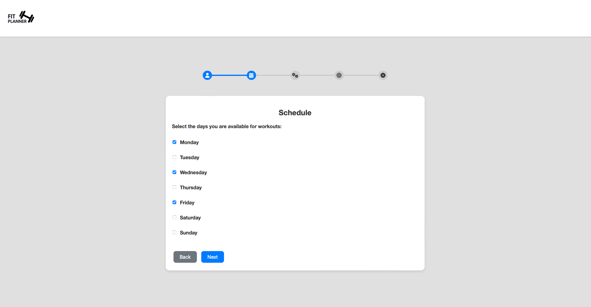
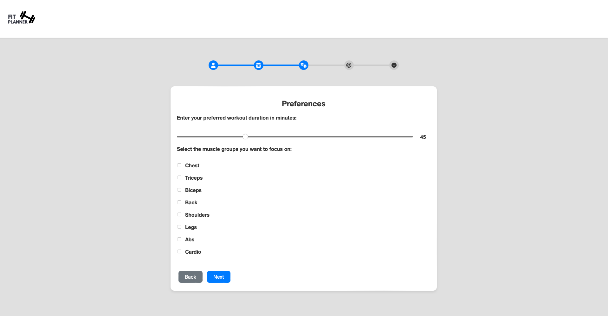
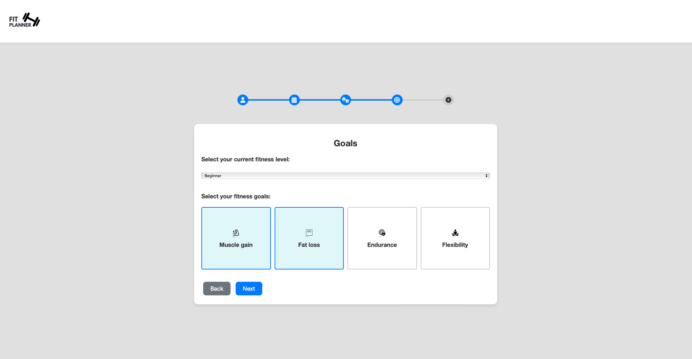
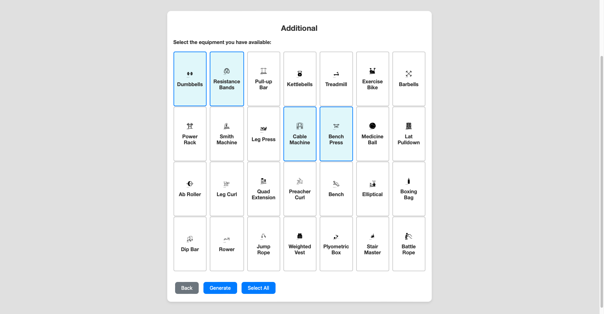
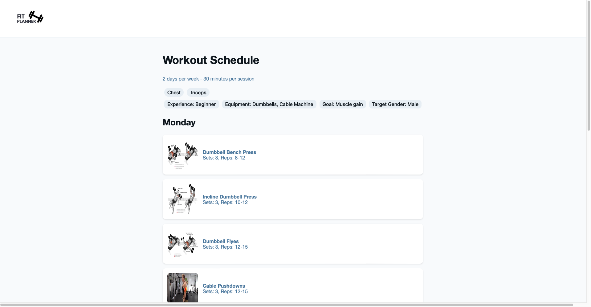
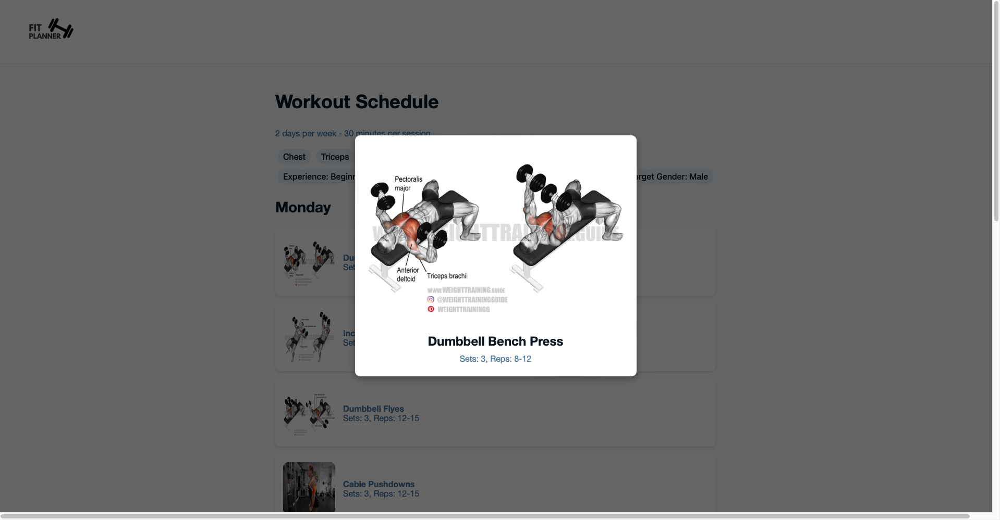

# Fit Planner

Fit Planner is an innovative web application designed to help users create workout routines. By leveraging the power of artificial intelligence, Fit Planner generates personalized workout plans tailored to individual preferences and fitness goals, ensuring that users get the most effective and efficient workouts possible.

## Features
- AI-generated workout plans
- Customizable workout preferences
- Clean and responsive user interface

## Screenshots









## Installation
1. Clone the repo:
   ```bash
   git clone https://github.com/yourusername/fit-planner.git
   ```
2. Install dependencies:
   ```bash
   pip install django
   pip install djangorestframework
   pip install -q -U google-generativeai
   ```
3. Set up the Django database:
   ```bash
   python manage.py migrate
   ```
4. Run the Django server:
   ```bash
   python manage.py runserver
   ```

## Usage
After setting up, you can access the application at `http://127.0.0.1:8000/`.

## Technologies Used
- Django
- JavaScript
- HTML/CSS

## Project Structure
- `fit_planner/` - Main Django app
- `static/` - Static files (CSS, JS, images)
- `templates/` - HTML templates

